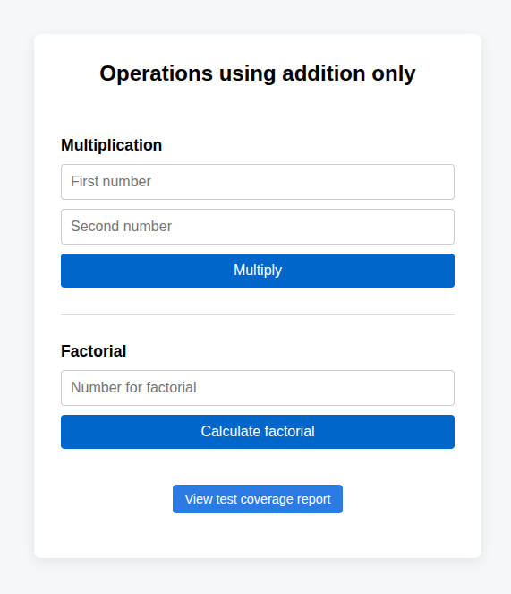

# teamblue-technical-test-exercise-2

**Solution for Exercise 2 of the team.blue Technical Test.**

This project implements integer arithmetic using **addition-only operations**, with numbers represented internally as arrays of digits.  
The solution supports **large integer multiplication** and **factorial calculation**, including values such as **100!**, as required by the exercise.

The implementation focuses on **clean Object-Oriented design**, immutability, separation of concerns, and strong test coverage.

## Problem Overview

The goal of this exercise is to implement multiplication without using the multiplication operator, storing integer values as arrays and relying exclusively on addition.  
Based on this constraint, the implementation must also be capable of computing large factorials (e.g. `100!`).

## Solution Highlights

- Custom `DigitArrayInteger` value object for arbitrary-precision integers
- Addition-based multiplication algorithm
- Dedicated `FactorialService`
- Clear separation between:
    - domain logic
    - input validation
    - presentation (HTML)
- Web interface for manual testing
- CLI support
- Comprehensive test suite with **100% coverage**
- Static analysis and code quality are enforced with:
    - PHPStan
    - PHPCS (Slevomat / Squiz)

## Project Structure

```text
.
├── public/                 # Web entrypoint (index.php, CSS)
├── src/                    # Domain and application logic
├── templates/              # HTML templates
├── tests/
│   ├── Unit/               # Unit tests (BDD/Gherkin style)
│   └── Integration/        # Integration tests
├── target/
│   └── coverage/           # PHPUnit HTML coverage report
├── docker/                 # Docker / NGINX configuration
└── composer.json
```

## Running the Application with Docker

1. Build and start the containers

```bash
docker compose up --build
```

2. Access the application

Open your browser at [http://localhost:8080/](http://localhost:8080/) or [https://localhost:8081/](https://localhost:8081/)

## Using the HTML Interface

The web interface allows you to:

- Multiply two integers 
- Calculate the factorial of a given number 
- Access the PHPUnit coverage report



## Running via CLI

The domain logic is fully decoupled from the web layer and can be used via CLI.

**Example: Multiplication**

```bash
docker exec -it team.blue-e2-php php bin/multiply.php "[5,1]" "[2]"
```

**Example: Factorial**

```bash
docker exec -it team.blue-e2-php php bin/factorial.php 10
```

> CLI inputs use JSON-encoded arrays or integers and are validated before entering the domain layer.

## Running Tests

### Run the full test suite:

```bash
docker exec -it team.blue-e2-php composer test
```

### Generate coverage report

```bash
docker exec -it team.blue-e2-php composer test-coverage
```

The coverage report can be accessed via the browser at: [http://localhost:8080/coverage/](http://localhost:8080/coverage/)

### Test Coverage

- 100% line and branch coverage 
- Unit tests written in **BDD/Gherkin style** (Given / When / Then)
- Integration tests focused on real collaboration between components 
- No mocks for domain logic

## Code Quality

The project enforces strict quality rules:

```bash
docker exec -it team.blue-e2-php composer paralel-lint
docker exec -it team.blue-e2-php composer phpcs
docker exec -it team.blue-e2-php composer phpmd
docker exec -it team.blue-e2-php composer phpstan
docker exec -it team.blue-e2-php composer psalm
```

or run the full quality check:

```bash
docker exec -it team.blue-e2-php composer lint
```

## Final Remarks

This implementation aims to demonstrate not only a correct algorithmic solution, but also professional PHP engineering practices, including clean architecture, testability, and maintainability.
